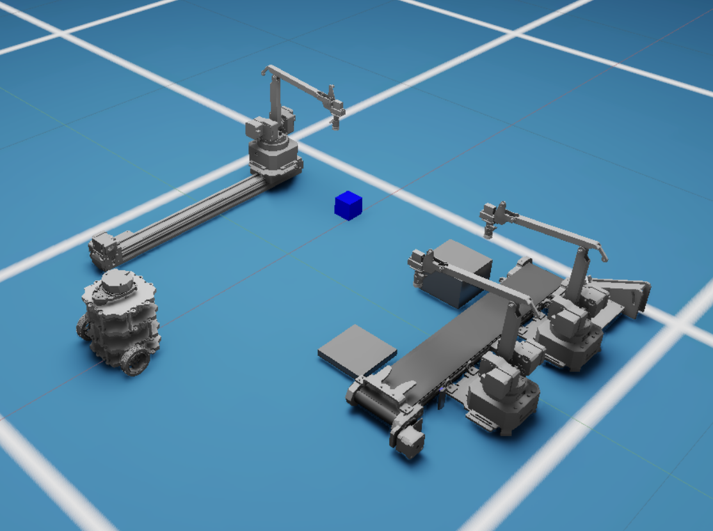

# demonstrator_isaac_sim

**Related Paper:**  

+ Constantin Enke, Jan-Felix Klein, Marvin Sperling, Benchun Zhou. **Development of an Experimental Environment to Study the Challenges in Cyber-Physical Intralogistics Systems**[C]//2022 Logistic Journal. [[**Link**](https://www.logistics-journal.de/proceedings/2022/5585/view?set_language=de)] [[**PDF**](./README_Picture/2022_Logistic_Journal.pdf)] [[**Slide**](./README_Picture/2022_Logistic_Journal_Slide.pdf)] 

+ If you use the code in your academic work, please cite the above paper. 

This repository shows the Simulation of the logistics environment with Isaac Sim. 


update 20230503
add json file

## prerequist
1. create python environment:

https://docs.omniverse.nvidia.com/app_isaacsim/app_isaacsim/install_python.html

create a python environment (conda) for isaac sim with the tutorial. 

Then, you can write a simple script to activate the python environment. 

I provide an example at "additional/isaac.sh" 

2. Configuring RMPflow controller for manipulater(uArm)

https://docs.omniverse.nvidia.com/app_isaacsim/app_isaacsim/advanced_tutorials/tutorial_configure_rmpflow_denso.html

find the file: 
```
.local/share/ov/pkg/isaac_sim-2022.1.1/exts/omni.isaac.motion_generation/motion_policy_configs/policy_map.json
```
add the following item: 
```
	"uArm":{
		"RMPflow" : "./uArm/config.json"
	},
```
create or copy uArm folder ("addition/uArm") to the config folder


## build and run the project
build the project
```
git clone https://git.scc.kit.edu/ifl_institute/robis/modelroboticswarehouse/demonstrator_isaac_sim.git
catkin_init_workspace
catkin build
```

run the project
```
source devel/setup.bash
python scripts/ifl_demonstrator.py
```

open another terminal, you can run 
```
rostopic list
python scripts/ifl_overall_process.py
```

### test individual robots
after building, you can test single robot by running: 
```
source devel/setup.bash
python scripts/ifl_uArm_bk.py 
# python scripts/ifl_turtlebot_bk.py 
# python scripts/ifl_slider_bk.py 
# python scripts/ifl_conveyor_bk.py 
```

for each robot, we also have corresponding clients: 
```
source devel/setup.bash
python scripts/uarm/uarm_client_test.py 
# python scripts/turtlebot/turtlebot_client_test.py 
# python scripts/slider/slider_client_test.py 
# python scripts/conveyor/conveyor_client_test.py 
```


## models
all models are save at src/
